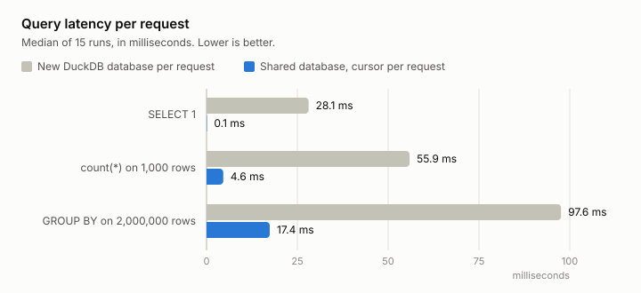

# NQ Lake 0.1.0

First release of the backend API, with the stack changes that came with it.

## Backend API

`make up` starts a FastAPI backend on the host next to the compose stack;
`make down` stops both. The API manages Iceberg tables through the Lakekeeper
REST catalog with PyIceberg and answers SQL with DuckDB. `/docs` holds the
interactive OpenAPI page; the README lists every endpoint.

- Namespaces and tables: list, create, describe, alter (rename, properties,
  added columns), drop.
- Rows: read by Iceberg filter, append as JSON, delete by filter.
- Parquet upload into an existing table or, when the table is missing, into a
  new table built from the file's schema. `/parquet/inspect` shows what an
  upload would do without writing.
- `/query` runs read-only SQL with DuckDB over the whole catalog.
- `/status` probes Lakekeeper, MinIO, Postgres, the catalog, and DuckDB.

Every table the API creates uses Iceberg format version 2. PyIceberg 0.12
reads version 3 but writes only version 2 manifests, so a version 3 table
could be created and never filled.

### Parquet types Iceberg lacks

An upload repairs what it can and reports every repair in the response;
anything else is rejected with one problem per column and nothing is written.
Unsigned integers widen, `float16` widens, dictionary columns decode, wide
decimals narrow when they fit, non-UTC time zones convert to UTC, large and
fixed-size lists become lists. Nanosecond timestamps and times truncate to
microseconds and are flagged `lossy`. Duration and interval columns, decimals
above 38 digits, typeless all-null columns, and repeated column names are
rejected.

### One DuckDB database per process

`/query` runs on one DuckDB database per process, opened on the first query
and attached read-only to the catalog. Each request gets its own cursor, so
requests run in parallel and share the attached catalog and DuckDB's file
caches. The alternative, a new database attached per request, paid the
extension load, the catalog handshake, and the first table fetch on every
call.

| Query | New database per request | Shared database |
|---|---|---|
| `SELECT 1` | 28.1 ms | 0.1 ms |
| `count(*)` on 1,000 rows | 55.9 ms | 4.6 ms |
| `GROUP BY` on 2,000,000 rows | 97.6 ms | 17.4 ms |

Median of 15 runs on the local stack, measured inside the process, so the
numbers exclude HTTP. Rows appended or deleted through the API are visible to
the next query. A commit that changes only a table's columns shows up in
`/query` about one second later; `GET .../tables/{table}` shows it at once.

## Stack

- Ports moved to one block: MinIO 40000, console 40001 (reserved, nothing
  serves it yet), Lakekeeper 40002, Postgres 40003, API 40004. The block
  stays clear of the usual defaults and of the ephemeral range.
- MinIO's embedded web console is off (`MINIO_BROWSER=off`); the lakehouse
  has its own console.
- The init jobs are scripts under `scripts/`. `minio-init.sh` creates the
  bucket and the non-root user Lakekeeper vends credentials with.
  `lakekeeper-init.sh` bootstraps the catalog, creates the warehouse when
  the catalog has none, and points an existing warehouse at MinIO's current
  port. Both run on every `make up`.
- The Makefile is `up`, `down`, `api`, `api-start`, `api-stop`, `api-logs`,
  `ps`, `logs`, `clean`. The `smoke`, `status`, `ports`, and `load` targets
  are gone with the CLI they called.

## Upgrading a checkout

1. Copy the port block and `API_PORT` from `.env.example` into `.env`, and
   remove `MINIO_CONSOLE_PORT`.
2. Run `make up`. It syncs the Python environment, which now includes
   FastAPI, uvicorn, python-multipart, and the `pyiceberg-core` extra that
   partition transforms such as `day(ts)` need on write. The init job moves
   the existing warehouse to the new MinIO port.

## Known limits

- `/query` takes one statement, without parameters, returns JSON only, and
  truncates at `limit` (at most 10,000 rows) with no cursor for the rest.
- Nested Iceberg types can only enter through Parquet upload; the create
  endpoint takes primitive types.
- No authentication. The API binds to 127.0.0.1 and is meant for the
  lakehouse's own console.
