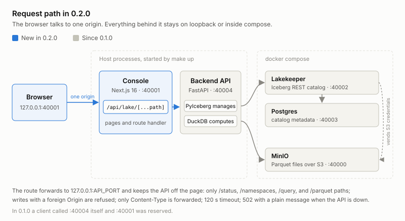
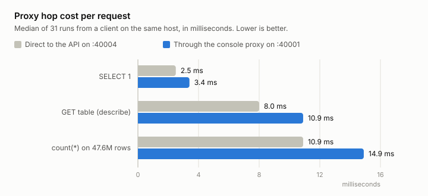

# NQ Lake 0.2.0

The console. Port 40001, reserved in 0.1.0, now serves a Next.js console
over the backend API. The API itself is unchanged.

## Console

`make up` builds and starts the console next to the API, and `make down`
stops both. The first start runs `npm ci` and `next build`, which takes a
minute or two; later starts reuse the build. Node.js 22.9 or later is
required. The console binds to 127.0.0.1 on `CONSOLE_PORT` from `.env` and
reaches the API on `API_PORT` from the same file.

- `make console` runs the development server in the foreground.
- `make console-start` and `make console-stop` manage the background console
  on their own; `make console-logs` follows its log. A console that is
  already running is left as it is, so stop it before starting one with new
  code.

The pages:

- **Overview** counts tables, namespaces, and rows across the catalog and
  lists the five most recently updated tables.
- **Data catalog** lists every table with its row count, format version, and
  last snapshot time. Search, filter by namespace, sort by name, rows, or last
  update, ten tables per page. The namespaces tab creates namespaces (a dotted
  name nests) and deletes empty ones. **New table** builds an Iceberg v2
  table from column names, types, and required flags.
- A **table page** has four tabs. *Data preview* reads up to 100, 500, or
  1,000 rows through an Iceberg filter such as `price > 10 AND side = 'A'`,
  pages them 25 at a time, and exports them as CSV. *Schema* lists the
  columns and adds a nullable one. *Metadata* shows the storage location,
  current snapshot, partitioning, and properties. *Manage* renames the table,
  appends a JSON array of rows, deletes rows by filter, and removes the table
  from the catalog while keeping its files. Deleting rows and removing a
  table require typing `namespace.table` first. **Query table** opens the SQL
  workspace with a `SELECT *` over the table.
- **SQL workspace** runs one read-only statement through `/query`. Cmd/Ctrl +
  Enter runs it, Tab inserts two spaces, the row limit goes from 100 to
  10,000, and the elapsed time shown includes the network. **Stop waiting**
  abandons the wait; the server may still finish the query. The last 20
  successful statements of the visit are kept as history. A table picker on
  the left inserts a query for any table.
- **Import data** takes a Parquet file, chosen or dropped. **Inspect file**
  shows each column's Parquet and Iceberg type and every repair the upload
  would make; a lossy repair needs a checkbox before the import button
  enables, and so does overwriting. *Create if not exist* makes the table
  from the file's schema. The result reports the rows written, the snapshot
  id, and the repairs applied.
- **Services** shows one card per probe of `/status`: Lakekeeper, MinIO,
  Postgres, the catalog, and DuckDB, each with the probe's detail and port.
  The dot in the header sums them up. Refresh is a button; nothing polls.

Cmd/Ctrl + K searches tables and pages from anywhere.

### One origin

The browser never calls the API. Every request goes to the console's own
origin, and the route at `/api/lake/[...path]` forwards it to
`127.0.0.1:API_PORT`. The route accepts only paths under `/status`,
`/namespaces`, `/query`, and `/parquet`, refuses a write that carries a
foreign `Origin`, forwards only the `Content-Type` header, gives up
after 120 seconds, and answers 502 with a plain message when the API is not
running. Parquet uploads stream through it without being buffered.

So the API keeps its 127.0.0.1 binding and needs no CORS, and the API port
is a server-side setting the page never sees.

### What the hop costs

| Request | Direct to the API | Through the console |
|---|---|---|
| `SELECT 1` | 2.5 ms | 3.4 ms |
| `GET .../tables/nq` (describe) | 8.0 ms | 10.9 ms |
| `count(*)` on 47.6 million rows | 10.9 ms | 14.9 ms |
| 100-row preview of the same table | 1,438 ms | 1,459 ms |

Median of 31 runs, alternating direct and proxied calls, from a Python
client on the same host, so both columns include HTTP. The console was the
production build (`next start`) and the table was one unpartitioned Iceberg
table of 47,560,719 rows. The hop adds one to four milliseconds. The row
preview takes about 1.4 seconds either way: that time is the API's PyIceberg
scan, not the proxy.

### 64-bit values stay exact

Iceberg snapshot ids and `long` columns exceed 2^53, and `JSON.parse` rounds
them. The console parses every API response with a reviver that reads the
source text of an integer outside the safe range and keeps it as a decimal
string, so the snapshot id on a table page and after an import is the real
one. In a browser without source text access in `JSON.parse`, such values
round as before.

### CSV export

Every field is quoted. A field that starts with `=`, `+`, `-`, `@`, a tab,
or a line break gets a leading apostrophe so a spreadsheet does not run it
as a formula. The file starts with a byte order mark so Excel reads it as
UTF-8. Null cells are empty.

## Stack

- The Makefile gained `console`, `console-build`, `console-start`,
  `console-stop`, and `console-logs`; `up` and `down` call the start and
  stop targets. The console's pid and log live in `images/console/state`.
- `.gitignore` covers the console's `node_modules`, `.next`, and
  `tsbuildinfo` files.
- `npm run typecheck`, `npm test`, and `npm run build` in `console/`
  validate the console. When a restricted environment blocks Turbopack's
  worker ports, build with `npm run build -- --webpack`.

## Upgrading a checkout

1. Install Node.js 22.9 or later and npm.
2. Check that `.env` has `CONSOLE_PORT`; it is in the port block 0.1.0
   introduced, and `.env.example` has it.
3. Run `make up`. The first start installs the locked npm dependencies and
   builds the console.
4. Open `http://localhost:40001`, or whatever `CONSOLE_PORT` is.

## Known limits

- No authentication, like the API. The console binds to 127.0.0.1 and is
  meant for one person on the host.
- A refresh describes every table in the catalog, eight at a time, to fill
  the overview and the catalog page. Its time grows with the number of
  tables.
- A row preview of a large table takes over a second, for the reason above.
- **Stop waiting** in the SQL workspace does not cancel the query on the
  server, and query history and results are lost when the page is left.
- Column types are a fixed list: twelve primitive types when creating a
  table, eight when adding a column. Nested types still enter only through
  Parquet upload.
- The API's `/docs` page is outside the proxied paths; open it on the API
  port directly.
- `make up` leaves a running console alone. Stop it first to pick up code
  changes.
- Light theme only.
